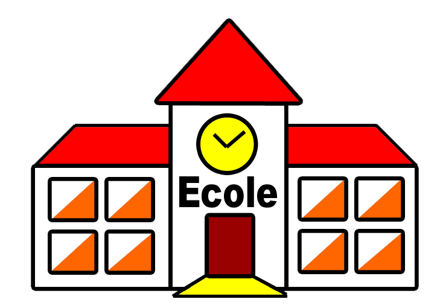

## A propos du projet

Ceci est un projet étudiant réaliser par mes soins pour la plateforme de formation en ligne Openclassroom, avec le Framework Laravel pour le côté Backend. Pour le côté Frontend, j'ai utilisé AJAX et du CSS simple, ainsi que Bootstrap.
Etant professeur en école primaire, j'ai voulu recréer le système de mise en garde (MEG) de façon informatisé. Ce système permettra au surveillant d'envoyer une mise en garde conçernant un élève, sans avoir besoin d'utiliser le format papier classique, qui est encombrant et qui prend beaucoup plus de temps à remplir.

## Les fonctionnalitées du projet

Plusieurs fonctionnalitées sont intégrées à ce projet, nous y retrouvons notemment :

- La possibilité de créer un compte Administrateur;
- La possibilité de se connecter avec un compte Administrateur; 
- La possibilité de créer une fiche élève basique (nom, prénom, classe);
- La possibilité de créer une mise en garde à l'élève concerner.

## Le côté Frontend

Du côté Frontend, du CSS classique et du AJAX ont été utiliser. Aussi, le responsive du site est totalement tirer de Bootstrap.

AJAX :
- Rafraichisement automatique des MEG pour l'élève concerner, dans le pannel d'administration.

## Installer le projet sur sa machine

_1- Connectez vous avec les bonnes permissions (optionnel)_

Etant connecté en tant que root ou superadmin sur votre serveur, assurez-vous de changer d’usager afin de vous connecter avec l’usager web par défaut de votre projet. 

Faites simplement :

 su votrenomdusager 

_2- Clonez votre repo *_

Que votre projet soit hébergé sur Github, Gitlab, Bitbucket ou autre, le tout reviens a GIT, donc nous pouvons utiliser git sur notre machine local ou serveur pour cloner notre projet.

git clone lienversvotrerepo.com/nomDuProjet
Notez que vous pouvez cloner votre projet de 2 manières différentes, un en mode HTTPS et un autre en mode SSH.  

ASTUCES PRO : Vous pouvez cloner votre projet à partir d’une branch spécifique en faisant 

git clone -b nomdelabranch lienversvotrerepo.com/nomDuProjet

_3- Accédez au répertoire de votre projet *_

Après votre clone, un nouveau dossier portant le nom de votre projet devrait etre crée dans votre emplacement actuel.

Vous devez simplement y accéder en faisant un ;

cd nomduprojet

_4- Installer les dépendances du projet à partir de composer_

Chaque fois que vous clonez un nouveau projet Laravel, vous devez installer toutes les dépendances du projet. C'est ce qui permet d'installer Laravel lui-même, parmi d'autres paquets nécessaires pour démarrer votre application. 

Lorsque nous lançons composer, il vérifie le fichier composer.json qui est dans votre repo et liste tous les paquets composer dont votre repo a besoin. Comme ces paquets changent constamment, le code source n'est généralement pas soumis à git, ceci grace au .gitignore qui devrait toujours contenir votre répertoire vendor.

Donc pour installer tout le code source nécessaire, nous lançons composer avec la commande suivante.

composer install

_5- Installer les dépendances NPM (optionnel)_

Ceci est exactement comme l’étapes précédente à la seule différence qu’il vous permettra d'installer Vue.js, Bootstrap.css, Lodash et Laravel Mix etc…

Bref au lieu d’installer du code PHP comme a l’étape précédente, il s'agit d'installer les paquets Javascript (ou Node) requis.

 La liste des paquets nécessaire dans ce cas sont indiquée dans le fichier ‘packages.json’.

Si votre projet n’utilise donc pas vue.js, node ou autre vous pouvez sautez cette étape sinon vous devez faire : 

npm install
D’autre préfere Yarn , si c’est votre cas faite simplement 

Yarn

_6- Créez une copie de votre fichier .env_

Les fichiers .env ne sont généralement pas soumis a votre repo, si ce n’est pas le cas je vous invite à corriger ceci pour des raisons de sécurité.

Mais il existe un exemple de fichier .env, qui est un modèle du fichier .env que tout projet Laravel a besoin pour démarrer. 

Nous allons donc faire une copie du fichier .env.example et créer un fichier .env que nous pourrons remplir avec nos paramètres de configuration.

cp .env.example .env

_7- Générez votre clé d’encryption_

Laravel exige que vous ayez une clé d’encryption pour chacune de vos applications, ceci est généralement généré de manière aléatoire et stocké dans votre fichier .env. L'application utilisera cette clé d’encryption pour encoder divers éléments de votre application, tels que les cookies, le hachages de mots de passe et bien d’ autres éléments.

Heureusement les outils en ligne de commande de Laravel permettent de générer cette clé très facilement. Dans le terminal, nous pouvons exécuter cette commande pour générer cette clé. 

php artisan key:generate
Fermez et ouvrez à nouveau votre fichier .env, vous devriez remarquez que votre clé s’est généré dans la variable : APP_KEY.

_8- Créez une base de données vide pour votre projet Laravel_

Créez une base de données vide pour votre projet en utilisant n’importe quels outils de base de données que vous préférez (Mon préféré est Datagrip pour mac, mais parfois j’utilise DBForge, ou Mysql Workbench ou meme le bon vieux Phpmyadmin).

_9- Configurez votre fichier .env pour permettre une connexion à la base de donnée_

Nous voudrons permettre à Laravel de se connecter à la base de données que vous venez de créer à l'étape précédente. Pour ce faire, nous devons ajouter les références de connexion dans le fichier .env et Laravel se chargera de la connexion à partir de là.

Dans le fichier .env, remplissez les options DB_HOST, DB_PORT, DB_DATABASE, DB_USERNAME et DB_PASSWORD pour qu'elles correspondent aux informations d'identification de la base de données que vous venez de créer. 

##titre 10- Ajouter les tables et contenus de votre base de données avec les migrations ou en sql

Les migrations dans Laravel vous permettent d’avoir toutes votre architecture de BD dans votre code et avec une simple ligne de commande vous pouvez recréer toutes vos tables.

php artisan migrate
Cette commande crée la structure de votre base de donnée mais ne remplis aucune tables.

Si votre dépôt dispose d'un fichier seed, c'est le moment de l’exécuter,  afin de remplir votre base de données avec des données de démarrage ou factices.

php artisan db:seed
ASTUCES PRO : Vous pouvez combiner les 2 précédentes commandes en une seule qui est celle-ci : 

php artisan migrate:fresh --seed
Les migrations sont supers pratique, mais si vous n’en avez pas ce n’est pas grave vous pouvez simplement importer le fichier sql de votre ancienne base de données avec votre outil de base de données préférées. Ceci créera toutes vos tables avec vos contenus.

<h1 align="center">Bonne visite sur le site !</h1>